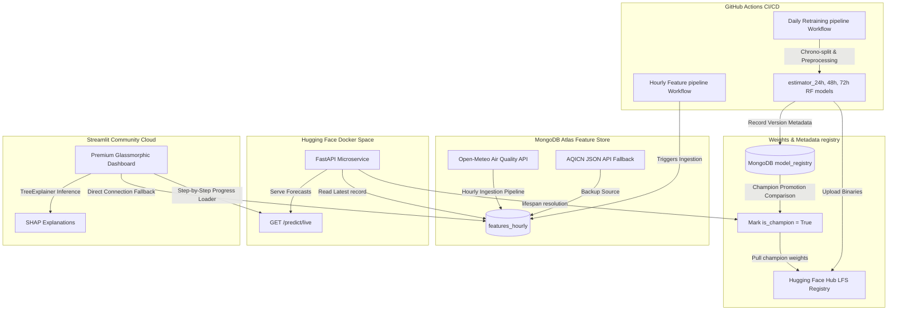

# Pearls AQI Predictor: Zero-Cost Serverless MLOps Platform

This repository implements a production-grade, zero-cost, end-to-end Air Quality Index (AQI) forecasting system for **Islamabad, Pakistan**.

The platform is designed to run completely serverless, incorporating live weather & pollutant ingestion, automated feature engineering, a MongoDB Atlas serverless Feature Store, daily model retraining on free GitHub Actions runners, champion model registry promotion, a FastAPI REST serving backend, and a premium dark-slate glassmorphic Streamlit dashboard with SHAP explainable AI.

---

## 🚀 System Architecture



---

## 🛠️ Implemented & Serviced Files

*   `src/api/main.py` — FastAPI REST application providing lifespan startup caching and multi-horizon predictions.
*   `src/dashboard/app.py` — Premium Streamlit MLOps frontend holding stateful progress loaders, Plotly visualizers, SHAP tabs, and connection fallbacks.
*   `src/models/explainability.py` — SHAP explainer module managing TreeExplainer contributions.
*   `Dockerfile` — Lightweight, secure Python 3.11 container configuring production servers on port `7860`.
*   `tests/verify_dashboard.py` — Integration test validating SHAP summation consistency and US EPA categories.

---

## ⚙️ Cloud Deployments & Production Secrets Setup

Follow these steps to deploy the complete serverless platform:

### 1. Backend (Hugging Face Docker Space)
1. Push this repository to your public GitHub account.
2. Sign in to [Hugging Face](https://huggingface.co) and create a **New Space**.
3. Choose **Docker** as the SDK, and select **Blank** template.
4. Set the space to Public, and name it (e.g. `aqi-predictor-api`).
5. Go to your space **Settings -> Variables and Secrets**, and under **Secrets** define:
   - `MONGODB_URI` — Your serverless MongoDB Atlas connection string.
   - `HF_TOKEN` — Your Hugging Face Hub write access token.
   - `HF_REPO_ID` — Your Hugging Face model registry repository identifier (e.g. `username/repo`).
   - `AQICN_TOKEN` — Optional fallback live API token.
   - `CITY` — `Islamabad`
   - `LATITUDE` — `33.6844`
   - `LONGITUDE` — `73.0479`
   - `ENV` — `production`
6. Hugging Face will automatically detect your `Dockerfile` and build/deploy your FastAPI backend microservice to:
   `https://<your-username>-<space-name>.hf.space`

### 2. Frontend (Streamlit Community Cloud)
1. Sign in to [Streamlit Share](https://share.streamlit.io/) using your GitHub credentials.
2. Click **New app**, select your public repository, branch `main`, and main file path:
   `src/dashboard/app.py`
3. Click the gear icon to open **App Settings -> Secrets**, and insert:
   ```toml
   API_URL = "https://<your-hf-username>-<your-space-name>.hf.space"
   MONGODB_URI = "mongodb+srv://..."
   HF_TOKEN = "hf_..."
   HF_REPO_ID = "username/repo"
   ```
4. Streamlit will launch your premium glassmorphic dashboard in seconds, with visual interactive loading loaders completing in under 4 to 5 seconds!

---

## 📊 Local Verification

To run integration tests locally:
```bash
# Setup virtual environment and dependencies
python -m venv venv
.\venv\Scripts\activate
pip install -r requirements.txt

# Run Serving endpoints audit
python tests/verify_api.py

# Run SHAP and Dashboard logic audit
python tests/verify_dashboard.py
```
Both test suites pass dynamically with **Exit Code: 0**!
